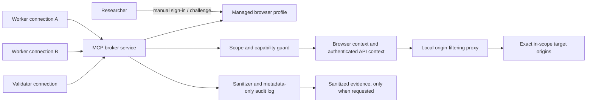

# Design: Shared Authentication Broker for BugHuntSkills

Date: 2026-09-24

Status: design and written spec approved in conversation on 2026-09-24

## Intent

Let the researcher sign in to an in-scope application once and let authorized
agent workers use that session through a shared, local broker. Browser cookies,
tokens, passwords, and MFA material stay inside a broker-managed browser
profile and never enter an agent prompt, tool result, engagement note, or audit
log.

The broker makes scope, account, method, technique, request-rate, and expiry
checks at the runtime boundary. It does not create authorization: current
program policy and the engagement scope contract remain authoritative. Unknown
or missing grants deny the request.

## Current project context

The repository is currently a documentation and research workspace, with no
runtime package to extend. The installed skills live outside Git under
`C:\Users\luong\.agents\skills`.

`bug-bounty-hunter` currently uses a connected signed-in browser to read
allowlisted Bugcrowd/HackerOne program pages. That platform session is read-only
and does not authorize target traffic. Target application authentication must
use a separate broker-managed profile. The `computer-use` skill is a GUI
control entrypoint and must not become a way to read or export the broker
profile.

## Goals

- Reuse one broker-managed target application session across multiple worker
  connections without exporting its browser profile, cookies, or tokens.
- Keep each worker's access tied to a researcher-controlled account alias and
  a least-privilege capability.
- Enforce the current machine-readable scope contract, explicit policy grants,
  exact target origins, permitted methods/techniques, rate limits, request
  budgets, concurrency, and expiry before target traffic.
- Support visible, researcher-completed sign-in and manual MFA/CAPTCHA handoff.
- Support browser-based application mapping and API requests that reuse the
  same browser context's authenticated cookie jar.
- Preserve separate sessions for different test accounts, especially for
  BOLA/BFLA testing and independent validation.
- Keep runtime session material outside the repository, OneDrive, engagement
  artifacts, prompts, and ordinary logs.

## Non-goals

- Reading or testing bounty-platform pages through the target application
  session.
- Inferring permission from safe harbor, related hostnames, discovered assets,
  or a model's interpretation of policy text.
- CAPTCHA/MFA bypass, credential harvesting, automatic acceptance of legal
  agreements, or replaying credentials from a prompt.
- Arbitrary JavaScript evaluation, unrestricted browser debugging, raw cookie
  or storage-state export, or uncontrolled HTTP clients.
- Automatically submitting bounty reports.
- Using third-party account data or production customer data as test fixtures.
- Generic API-token onboarding in v1. The first release reuses the managed
  browser context for API calls; an official, documented token provider can be
  added later without exposing its secret to a worker.

## Approaches considered

1. **Managed browser broker (selected).** One local service owns private
   persistent browser profiles and exposes a narrow MCP interface. It supports
   web UI mapping and API requests while keeping authentication inside the
   service. It adds a runtime package and a local installation step.
2. **Credential-injecting HTTP proxy.** A server-side proxy attaches a token to
   worker requests. This fits API-only targets, but it does not cover SSO/MFA
   browser flows well and adds token-provider complexity.
3. **Skill instructions over the existing browser.** This is quick but cannot
   enforce a request boundary; workers could use the browser outside the
   proposed guard.

The managed browser broker is selected because the primary use case is a
researcher signing in to a web application, potentially through SSO/MFA, while
workers need both browser mapping and bounded API access.

## Architecture



One singleton broker service owns all profiles. MCP connections are distinct
server-side clients. Each connection starts without a capability; the
researcher assigns a role/account grant in the broker's local control surface,
which lists server-created connection IDs for approval and revocation. That
control surface is separate from worker tools; each grant/revocation requires
an explicit researcher action. The
grant is stored against the server-created connection identity, not a
worker-supplied identifier and not a prompt value. If the host cannot provide
distinct client connections or preserve that identity, the broker disables
parallel workers and allows only one active worker connection.

The MCP service binds to loopback only, validates the local Host/Origin
boundary, and rejects remote or DNS-rebinding-style access. Its transport
identity and worker capability are distinct from the application's login
session. The broker never returns a credential or app-session token.

### Components

| Component | Responsibility |
|---|---|
| Broker service | Singleton lifecycle, MCP tools, connection identity, policy and session registry, user control surface. |
| Scope contract loader | Validates a versioned `broker-policy.json`; rejects missing fields, stale policy snapshots, wildcard origins, and grants without a policy reference. |
| Capability manager | Binds account alias, engagement, operations, origin/method/technique grants, request limits, expiry, and connection identity. Starts with no access. |
| Browser session manager | Opens one separate persistent Chromium profile per engagement/account; handles session state, expiry, manual login handoff, and revocation. |
| Request guard | Applies policy checks, rate/budget limits, concurrency limits, HTTP-method rules, redirect behavior, and stop conditions. |
| Local egress proxy | Allows outbound connections only to the exact origin set active for the account. Blocks an off-scope redirect or resource origin at the connection boundary. |
| Output sanitizer | Removes authentication headers, cookie headers, token-like values, sensitive form values, and configured researcher data before returning output or saving evidence. |
| Audit/evidence writer | Records decision metadata only by default. Writes minimal sanitized evidence only on an explicit request. |

### Runtime and browser choices

The first implementation targets the researcher's Windows workstation. It is
a TypeScript/Node local service using the official MCP TypeScript server SDK
and Playwright. MCP runs on a loopback-only, stateful Streamable HTTP endpoint
so multiple worker connections can reach one profile-owning process. The
server validates Host/Origin headers and does not bind to a LAN or public
interface.

Playwright uses a dedicated persistent `userDataDir` per account, never the
researcher's default Chrome profile. Only one broker process may open a given
profile. Service workers are blocked so page requests cannot bypass the
browser request guard. Downloads, traces, video, and HAR capture are disabled
by default. All browser traffic must use the broker proxy; direct egress,
proxy bypass, and UDP/QUIC paths are disabled or blocked. If the workstation
cannot enforce that, target capabilities remain disabled. A broker-owned local
proxy enforces the exact target origin set for browser network connections.
API calls use the associated
browser context request API so they share the browser cookie jar, with
automatic redirects disabled and each redirect checked before it is followed.
The API request adapter must use the same origin-filtering proxy. If the
selected Playwright request path does not use that proxy, the broker must
configure it explicitly while keeping any cookie synchronization inside
process memory; if it cannot prove both proxy use and session isolation, API
request capabilities remain disabled.

Browser UI mapping is read-only after sign-in: page-initiated `GET`/`HEAD`
requests are allowed only within the policy, and other methods are blocked by
default. Active API probes use the broker request tool, which checks the exact
method, technique grant, endpoint origin, request-size ceiling, budget, and
redirect chain. WebSocket connections are denied in v1. External identity
provider origins are allowed only in user-attended login bootstrap and are
never treated as testing targets.

The broker cannot infer that every `GET` is free of business side effects.
`act_on_observed_element` therefore permits ordinary anchor navigation and
filling researcher-controlled fields, but never submits forms or activates
buttons with unknown effects. A program-permitted test that needs such an
action uses the explicit API request path or pauses for researcher approval.

### Session storage and isolation

- Profiles live under the current user's local application-data directory,
  outside the repo and OneDrive, with user-only filesystem permissions.
- A persistent profile contains credential-equivalent browser state even
  though the broker never exports it. Persistent-on-restart mode requires
  operating-system volume encryption; when that condition is unavailable, the
  broker uses a non-persistent in-memory context that writes no browsing data
  to disk. It remains shareable while the daemon runs, and the researcher
  signs in again after a broker restart.
- The broker never creates `storageState.json` exports. It does not inspect or
  return cookies, `localStorage`, or `sessionStorage` values.
- Each account alias gets a separate profile. Session A is never copied into
  B or the validator account.
- The broker holds one process lock per profile and rejects attempts to start a
  second browser against the same profile.
- Session metadata records only account alias, engagement ID, state, policy
  revision, creation/last-checked/expiry times, and revocation state.

## Scope contract and capability

The scope contract remains the human-reviewed source. The broker consumes a
derived `engagements/<program>/<date>/broker-policy.json` and validates it; it
does not decide whether the underlying program policy is legally sufficient.
`bug-bounty-hunter` must record the source URL, exact section, snapshot time,
and relevant explicit grant before producing a capability request.

Illustrative schema (field names are normative; identifiers and URLs below
are synthetic examples):

```json
{
  "schemaVersion": 1,
  "engagementId": "acme-rocket-2026-09-24",
  "policySnapshot": {
    "url": "https://program.example/rules",
    "revision": "displayed revision or date",
    "capturedAtUtc": "2026-09-24T00:00:00Z",
    "freshUntilUtc": "2026-10-01T00:00:00Z"
  },
  "accountAliases": ["researcher-a", "researcher-b"],
  "loginOrigins": [
    {
      "origin": "https://login.identity.example:443",
      "purpose": "user-attended sign-in only"
    }
  ],
  "refreshOrigins": [],
  "targetOrigins": ["https://app.example:443"],
  "grants": [
    {
      "accountAlias": "researcher-a",
      "technique": "read-only application mapping",
      "methods": ["GET", "HEAD"],
      "policyReference": "Rules > Testing restrictions > paragraph 3"
    }
  ],
  "limits": {
    "requestsPerSecond": 1,
    "maxConcurrentRequests": 1,
    "maxRequestsPerCapability": 100,
    "maxRequestBodyBytes": 65536,
    "expiresAtUtc": "2026-09-24T08:00:00Z"
  },
  "stopConditions": [
    "unexpected researcher-uncontrolled data",
    "service degradation",
    "scope or method ambiguity"
  ]
}
```

Contract rules:

- Origins are normalized exact `scheme://host:port` values. The broker does
  not expand wildcards or inherit scope to a CDN, shared IP, redirect target,
  subdomain, or third-party service.
- `targetOrigins` are distinct from user-attended login origins. A login-origin
  grant has no worker capability and no active-test operation.
- Login origins are exact and available only while the researcher is present
  in the sign-in bootstrap. They cannot be used by a worker to test an
  identity provider or any target.
- `refreshOrigins` is empty unless the program and the application's official
  documentation permit a specific refresh origin/method. A refresh grant is
  broker-internal and cannot be invoked directly by a worker.
- An absent method, technique, account, rate, budget, expiry, policy reference,
  or fresh policy snapshot denies active requests. Safe harbor alone is not a
  grant.
- Initial broker ceilings are 1 request/second, one concurrent request, 100
  requests per capability, and a 64 KiB request body. The program's stricter
  limit wins. Raising a ceiling requires an explicit policy grant and a
  researcher-approved capability.
- A material policy revision change revokes affected capabilities. The hunter
  must refresh the policy snapshot under its existing freshness rules before
  issuing new grants.
- The broker blocks IP-literal, loopback, link-local, private, and metadata
  service destinations by default. Any exception must be explicitly present in
  the reviewed contract.
- The proxy resolves each hostname itself, rejects forbidden address ranges,
  and pins the validated resolution for that connection to prevent a DNS
  rebinding/time-of-check gap.
- A new state-changing or otherwise high-impact operation pauses for explicit
  researcher approval even when the program permits the technique. The broker
  does not infer business impact from an HTTP method alone.

## Tool surface

The worker-facing MCP server exposes only these operations:

| Tool | Behavior |
|---|---|
| `session_status` | Returns metadata-only session state for the caller's assigned account. |
| `open_login` | Opens the visible, user-attended login window. No worker capability is active during bootstrap. |
| `observe_page` | Returns a sanitized accessibility/DOM summary for the active in-scope page. |
| `navigate` | Navigates to an exact permitted origin; the proxy blocks all other origins. |
| `act_on_observed_element` | Operates only on a recently observed element. Page-triggered non-read methods are denied. |
| `authorized_request` | Sends a bounded API request using the authenticated context after checking every policy field. Automatic redirects are off; each hop is revalidated. |
| `revoke_capability` | Revokes the calling worker's capability. |
| `close_session` | Closes/revokes a profile session; researcher control only. |

There is no arbitrary `evaluate`, DevTools/CDP, cookie/storage inspection,
profile path, shell, raw HTTP client, or report-submission tool. Authentication
headers are constructed inside the broker. Caller-supplied `Cookie`,
`Authorization`, or equivalent credential headers are rejected.

## Workflow and state transitions

1. `bug-bounty-hunter` reads the live program policy and fills the existing
   scope contract. Platform-page authentication remains read-only and separate.
2. The hunter writes the derived broker policy with exact origins, accounts,
   permitted techniques/methods, limits, freshness, and source references.
3. The researcher starts the target account profile. The visible browser opens
   to the application's normal sign-in flow. The researcher completes
   passwords, MFA, CAPTCHA, and any required interactive identity-provider
   step. The agent does not type or record secrets. The broker then marks the
   session `active`.
4. Each worker creates a separate MCP connection. It has no capability by
   default. The researcher assigns its account alias and role in the local
   broker control surface; the broker stores the grant against that server-side
   connection. The worker receives only allowed tools, never the grant handle
   or application credentials.
5. Mapping uses broker observations and read-only browser requests. Authorized
   API tests use `authorized_request`; BOLA/BFLA workers use separate account
   capabilities and researcher-owned data.
6. A validator receives a separate connection and separate account profile.
   The same session cannot be described as independent validation.
7. At session end the researcher revokes capabilities and optionally closes
   the profile. Revocation immediately blocks new traffic. Retention and
   deletion follow the program's policy and researcher direction.

Session states: `not_configured`, `login_required`, `user_action_required`,
`active`, `expired`, `revoked`, and `error`. Broker restarts with a persistent
profile restore the session as `login_required`. The broker may confirm it
with a read-only status request only when that exact check is authorized in
the scope contract; otherwise the researcher confirms or repeats sign-in in
the attended window. A non-persistent context always returns to
`login_required` after restart.

## Request enforcement

Before every target request, the guard checks:

1. The worker's server-side capability is active and unexpired.
2. The engagement policy snapshot is current and the requested account alias
   matches the capability.
3. The exact destination origin is in the target allowlist, passes destination
   checks, and remains allowed after any redirect.
4. The method and technique are explicitly granted for the account.
5. Request size, per-origin rate, total request count, concurrency, and the
   capability time window remain within limits. An active API endpoint must
   also be present in the authorized application map or named in the
   researcher-reviewed request grant; the broker is not an endpoint
   enumeration tool.
6. The operation uses only broker-generated authentication; caller-supplied
   authentication fields are rejected.
7. The response is sanitized before any content is returned or saved.

The browser proxy filters the host and port on every outbound connection,
including cross-origin browser redirects. Playwright's browser request route
checks page-request methods; service workers are blocked. Page UI automation is
read-only, so state-changing tests must use the separately gated API request
tool. The API tool disables automatic redirects and manually validates each
hop. It also blocks redirects that change to an unlisted origin or exceed the
configured hop limit.

## Failure handling

| Event | Broker action |
|---|---|
| `401` | Mark the session `expired`, pause dependent workers, and do not replay the request. Use an officially supported refresh flow only if explicitly configured and granted. |
| `403` | Return the authorization result as observed; do not refresh or retry. |
| `429` | Stop queued target requests. Resume only under the policy's documented backoff/rate rules. |
| CAPTCHA, MFA, sign-in, permission prompt, or revised legal terms | Disable worker capabilities and hand control to the researcher. Never bypass or accept on their behalf. |
| Off-scope origin, redirect, method, or technique | Deny before dispatch, log a redacted denial reason, and preserve the scope gap. |
| Timeout / connection loss | Stop new requests. Never automatically replay a possibly state-changing request; report the outcome as unknown until safely checked. |
| Broker/proxy/profile error | Fail closed and disable all target operations until the researcher resolves it. |
| Unexpected third-party data or apparent real-user data | Stop that candidate, suppress further body output, and follow the existing evidence-minimization flow. |

## Output, evidence, and audit

- Tool results redact `Cookie`, `Set-Cookie`, `Authorization`, common bearer/JWT
  forms, secret query parameters, password form values, and configured test
  secrets before returning to the model.
- Redaction is not a general personal-data detector. Researchers must use
  controlled accounts and synthetic data, and stop if third-party data appears.
- No request or response bodies are logged by default. Audit entries contain
  timestamp, engagement ID, server-side connection ID, account alias, policy
  revision, normalized origin, method, operation category, decision, status,
  and latency only.
- Evidence capture is opt-in per artifact. The broker writes a sanitized copy
  into the engagement evidence directory, checks the output, and never writes
  raw headers or profile data. Raw captures are not retained by default.
- `engagement.md`, `scope.md`, `notes.md`, findings, and submission trackers
  record account aliases and policy references only.

## Operational limits

- Applications that require service workers for core behavior may not work
  correctly in the guarded browser. The broker marks that feature blocked and
  uses an explicitly authorized API route if one exists; it does not disable
  the guard to make the page work.
- The egress proxy enforces host/port origin boundaries without decrypting
  TLS. Browser-side method checks apply to the initiating page request; API
  redirect hops are checked individually. UI-driven testing that requires
  arbitrary state-changing requests is outside v1.
- The broker can sanitize known credential formats and researcher-provided
  values, but it cannot guarantee detection of every secret or personal-data
  value. Controlled accounts, synthetic data, and the stop rule remain
  necessary.
- Parallel-worker capability assignment requires distinct MCP client
  connections. Hosts that expose only one shared connection run one active
  worker at a time.

## Skill integration

The versioned runtime package and operator documentation live in this
repository under `runtime/authentication-broker/`. The installed skill edits
are made at the existing user-level skill paths and must be called out as
outside Git:

- `C:\Users\luong\.agents\skills\bug-bounty-hunter\SKILL.md`
- `C:\Users\luong\.agents\skills\bug-bounty-hunter\chapters\01-phase-map.md`
- `C:\Users\luong\.agents\skills\bug-bounty-hunter\chapters\02-session-checklist.md`
- `C:\Users\luong\.agents\skills\bug-bounty-hunter\chapters\06-authenticated-program-intake.md`
- Add `C:\Users\luong\.agents\skills\bug-bounty-hunter\chapters\07-target-authentication-broker.md`
- `C:\Users\luong\.agents\skills\computer-use\SKILL.md`

`bug-bounty-hunter` owns policy intake, the target broker contract, capability
eligibility, account-role separation, and stop/resume decisions. Its platform
intake stays read-only. `computer-use` permits the researcher to operate the
visible broker sign-in window only; it must not inspect the profile, extract
session material, or drive target actions around the broker. All worker target
traffic uses the broker.

## Acceptance criteria

- The researcher can complete sign-in once in an isolated profile and multiple
  distinct worker connections can reuse that profile without receiving
  credentials or storage state.
- Account A, account B, and validator profiles are separate and cannot be
  substituted through a tool argument.
- A worker cannot send a request until the researcher assigns a capability to
  that server-side connection.
- Requests outside an exact origin, method, technique, account, rate, budget,
  or expiry are rejected before dispatch.
- Cross-origin redirects are denied by the egress proxy; API redirects are
  manually checked hop by hop; page-initiated non-read methods are denied.
- Service worker requests cannot bypass the broker guard; WebSockets are
  denied in v1.
- `401`, `403`, `429`, user challenges, timeouts, policy changes, and broker
  failures follow the stop behavior defined above.
- Secrets do not appear in tool results, policy files, evidence by default, or
  audit logs. Persistent profile files remain outside Git and OneDrive and are
  stored only under the configured OS protection requirements.
- Runtime verification uses local mock targets and synthetic accounts only;
  no live bounty target is contacted as part of implementation validation.

## Source notes

Official documentation reviewed on 2026-09-24:

- Playwright `launchPersistentContext`: persistent browser data directories
  store cookies and local storage, only one browser instance can use a given
  directory, and a separate automation profile is required; the default Chrome
  profile is unsupported for automation.
  https://playwright.dev/docs/api/class-browsertype
- Playwright `BrowserContext.route`: context routing does not intercept
  service-worker handled requests; the documentation recommends blocking
  service workers when relying on request interception. Non-persistent browser
  contexts do not write browsing data to disk and are the fallback when the
  machine cannot safely persist the profile.
  https://playwright.dev/docs/api/class-browsercontext
- Playwright network routing: a route handler sees the original request once;
  the browser follows redirects itself. This is why the broker adds an
  origin-filtering proxy and uses manual API redirect checks.
  https://playwright.dev/docs/next/network
- Playwright `APIRequestContext`: a browser context's associated request
  context shares its cookie jar; `maxRedirects: 0` disables automatic redirect
  following.
  https://playwright.dev/docs/api/class-apirequestcontext
- MCP TypeScript server SDK: the current server package exposes tools and
  supports Streamable HTTP and stdio transports; the SDK server guidance
  includes local-server Host-header/DNS-rebinding protection.
  https://github.com/modelcontextprotocol/typescript-sdk/blob/main/packages/server/README.md
  https://ts.sdk.modelcontextprotocol.io/v2/
  https://ts.sdk.modelcontextprotocol.io/v2/api/%40modelcontextprotocol/node/streamableHttp.html
  https://ts.sdk.modelcontextprotocol.io/v2/api/%40modelcontextprotocol/node/middleware/hostHeaderValidation.html
